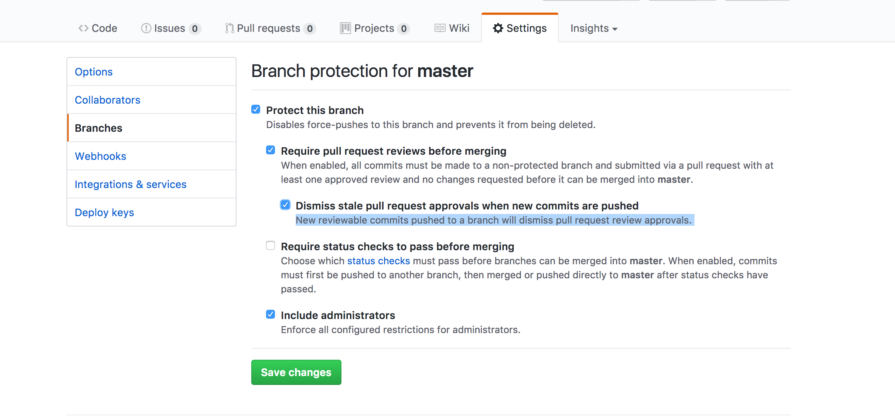

# Git 4 Groups Activity
Do this activity in your pod before next week's 2nd Git4Groups Lecture. 

## Assignment Steps
- One group member should fork and clone this repo.
- Add all other members as collaborators.
- Set up the master branch to require Pull Requests before merging. (See Github Settings image below).
- Everyone should clone the forked repo to their computer.
- Check out the Github project board on the original repo and duplicate it on your fork. Create the following tasks:
	- Ticket for each group members favorite things
	- Style the site
	- Add a page header and description
- Assign all the tickets
- Do the first task together, so everyone can follow long. Pick a simple one like 'Add page header'. (Follow Git4Groups steps below)
- Each group member on their own computer should start work on their individual tickets. (Follow Git4Groups steps below)

## Git4Groups Steps
### No Conflicts
1. Git pull. Git the most up to date master.
2. Create a new branch for your ticket/feature.
3. Do the work and commit it to the branch.
4. Push the branch to github. Try `$: git push`, it wont work because it is a new branch, but it will spit out the command you need.
5. Open a Pull Request. Add a team member or two as a reviewers. Follow [this documentation](https://help.github.com/articles/creating-a-pull-request/) if you need help doing this. 
6. Once they review it, you can hit the `merge` button on the github ui. This will incorporate the changes from your feature branch into the remote version of master. 
7. To start another feature go back to master and start with a pull to get down the new version of master.
8. You can clean up the feature branch locally and on the remote any time. (See Delete Branches)
 
### Conflicts
The above steps still apply, but now you have a conflict that is preventing you from merging down to master.

Find an instructor if you like and we can walk you through this.

1. Locally checkout master branch and pull to get all the latest changes. 
2. Check out your feature branch and type: `$: git merge master`. This will merge master into your branch, forcing you to address the conflicts locally on the feature branch.
3. Do a git status and see which files have conflicts. Open each of those files and make the code look like you want it to. You will need to remove `<<<` and `===` characters that separate what was conflicting on both branches. Some times you will pick one of the branches, sometimes you will need a bit of both sections. Git leaves it up to you. VS code might have some nice highlight for this.
4. After fixing all the files, save and git add them.
5. Type `$: git commit`
6. This will put you into vim editor, to exit type `:wq`. (Colon, w, q). This finalized the merge commit. You can see it if you type: `$: git log`
7. Push changes up to github. You should now be able to merge cleanly.

This guide might be helpful too: [https://help.github.com/articles/resolving-a-merge-conflict-using-the-command-line/](https://help.github.com/articles/resolving-a-merge-conflict-using-the-command-line/)

## Github Settings 
Under settings and branching select the following settings to lock down master branch from merging.

## Delete Branches
See this document for deleting: [delete-branches.md](delete-branches.md)